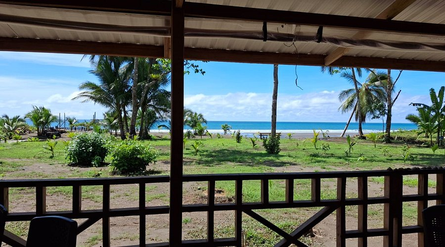

# 🌴 ZELVAMAR – Landing Page

Bienvenido al sitio oficial del Hotel **ZELVAMAR**, un refugio natural entre el mar y la montaña en la costa pacífica de Colombia. Esta landing page fue desarrollada con React, Bootstrap, y animaciones AOS, como parte de una solución digital moderna y escalable.



🔗 **Sitio en línea**: [https://zelvamar.vercel.app](https://zelvamar.vercel.app)

---

## ✨ Tecnologías utilizadas

- ⚛️ React (Create React App)
- 🎨 Bootstrap 5
- 🎞️ Animate On Scroll (AOS)
- 💡 Glassmorphism UI
- ☁️ Despliegue con [Vercel](https://vercel.com)

---

## 📦 Estructura del proyecto

zelvamar-landing/
├── public/
│ ├── hero-bg.jpg
│ ├── room1.jpg
│ ├── zelvamar-logo.png
├── src/
│ ├── components/
│ │ ├── Navbar.jsx / Navbar.css
│ │ ├── Hero.jsx / Hero.css
│ │ ├── Rooms.jsx / Rooms.css
│ │ ├── Contact.jsx / Contact.css
│ │ ├── Footer.jsx / Footer.css
│ │ └── WhatsappButton.jsx / WhatsappButton.css
│ ├── pages/Home.jsx
│ ├── App.js
│ └── MainApp.js


---

## 🚀 Cómo ejecutar localmente

```bash
git clone https://github.com/TU_USUARIO/zelvamar-landing.git
cd zelvamar-landing
npm install
npm start
```

Asegura agregar 15 imagenes en la carpeta `public` llamadas `carrusel1.png` a `carrusel15.png` para que el carrusel funcione.
